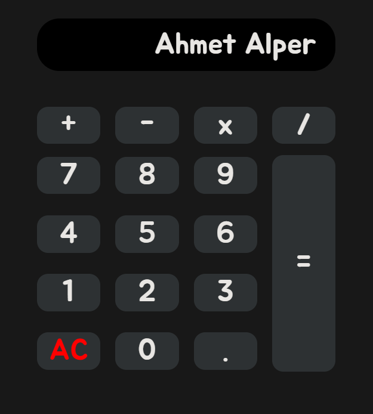

# HTML CSS JavaScript Calculator

This project is a simple calculator created using basic `HTML`, `CSS`, and `JavaScript`.

The project can be viewed live at : [https://ahmetalper0.github.io/html-css-js-calculator](https://ahmetalper0.github.io/html-css-js-calculator/)

## Features

- Performs basic mathematical operations ( `addition`, `subtraction`, `multiplication`, `division` ).
- User-friendly interface.

## How to Use

1. Input numbers and operations by clicking on the buttons.
2. Click `=` to see the result.
3. Click `AC` to clear the input.

## Screenshots

